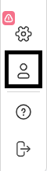
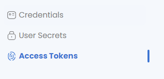
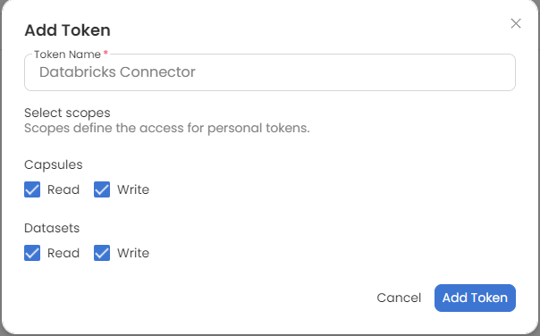
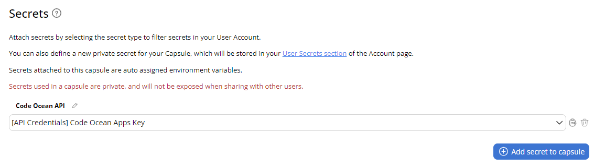
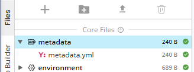
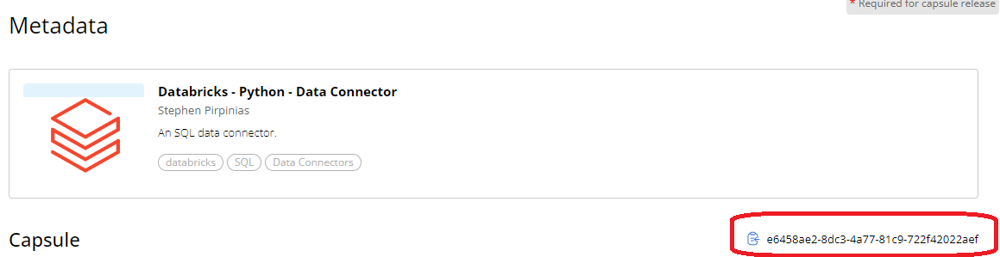
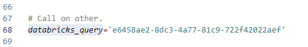
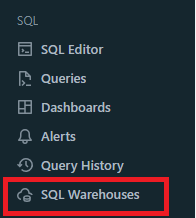
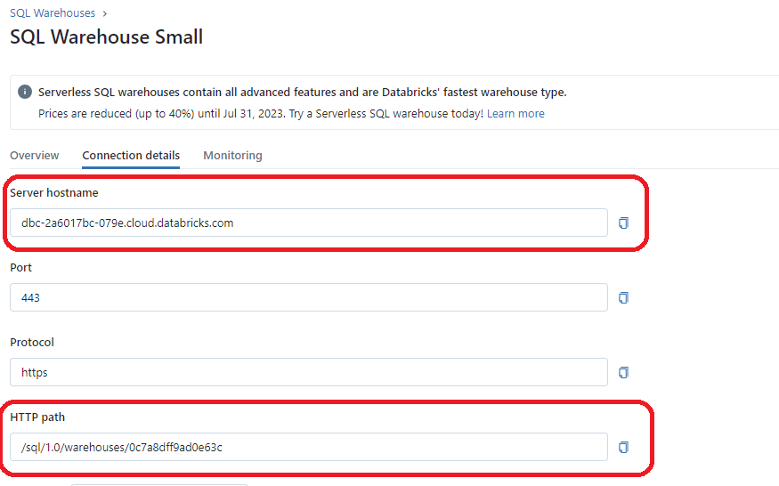
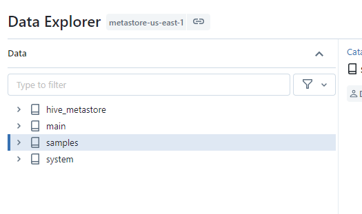

  
#  DataBricks - Python - Data Asset Generation

This tool is designed to create a connection between Code Ocean and your SQL Warehouse in Databricks, submit a query, and create a data asset. The query is performed by a separate capsule (Databricks - Python - Data Connector). 

## Configuration

### Generate API Token

In Code Ocean
1. Go to your user profile

2. Go to Access Tokens

3. Create an API token with full read write access to Capsules and Data Assets

4. Update API Secret to point to the correct API token. 

### Point to Query capsule

In order to use the "Databricks - Python - Data Connector" capsule into your environment, you will need to update the metadata ID this capsule is pointing to. 

1. Browse to the "Databricks - Python - Data Connector" capsule in your environment. 

2. Go to the "Metadata" tab. 

3. Copy the metadata id from the Query capsule

4. In the **config.sh** file in this capsule, edit "databricks_query" to match the correct metadata for your Query capsule: 

## Get Parameter Information from Databricks

In your Databricks workspace, go to SQL Warehouse. Select your warehouse. Press Connection Details.
Use these as input for this capsule.

- Hostname
- HTTPPath

In your Databricks account, go to Data, select the dataset you wish to query, and get "Catalog" name.

- Catalog
      

      
## App Panel Parameters

Hostname
- Workspace hostname, see [Get Parameter Information from Databricks](## Get Parameter Information from Databricks) [default: dbc-2a6017bc-079e.cloud.databricks.com]

HTTPPath
- Workspace hostname, see [Get Parameter Information from Databricks](## Get Parameter Information from Databricks) [default: /sql/1.0/warehouses/0c7a8dff9ad0e63c]

Catalog
- SQL warehouse catalog, see [Get Parameter Information from Databricks](## Get Parameter Information from Databricks) [default: hive_metastore]

SQL Query
- SQL Query to execute. This should be a "SELECT" statement pulling data from the warehouse. [default: SELECT * FROM default.diamonds LIMIT 2]

Output File Name
- Name for output file, does not include extension [default: output]

Output Format
- Data format to output. [default: csv]

Data Asset Name
- Name for the output Data Asset [default: MyDataAsset]

Folder Name 
- This is where the data will be found when it is attached to a capsule. Note, this can be edited after attaching. [default: Mount]

Tags 
- Free text tags to describe data asset. Note that at least one tag is required. [default: Research]

Domain
- Code Ocean Domain [default: apps.codeocean.com]

## Output

A dataset with your table from SQL query requested in .csv/tsv format.

## Source

https://docs.databricks.com/dev-tools/python-sql-connector.html

[Code Ocean](https://codeocean.com/) is a cloud-based computational platform that aims to make it easy for researchers to share, discover, and run code.  
